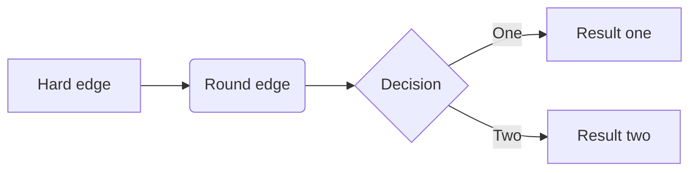

# Nodes running at bootstrap

```
We will have N+1 shards running at bootstrap where shard 0 is considered as beacon shard. As the staking will happen in beacon shard the beaconchain block should contain accounts where the new node utilizes to register. We will keep the current node as bootstrap nodes running as beaconchain which provide with followings:

1. Provide the communication protocol with new node.
2. How staking happens.
3. Data structure for staking
4. How to update discovery with DNS Seeder (bootnodes)
5.
```


